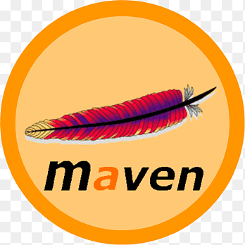

<h1 align="center">Hi , I'm <a>Rizgar</a>  
 Welcome to My GitHub Page</h1>

- 🔭 I’m currently working on **AWS & DevOps**
- ⚡ Here are some of my projects that i want to share with you

## SKILLS & TOOLS
                

## CERTIFICATIONS

## CERTIFICATIONS

</a>

## AWS Projects
|  Name                  |                                                    Description                                                                       |
| ----------------------- | :---------------------------------------------------------------------------------------------------------------------------------------: |
| Flask-Web-Application       |[Handling Routes, Templates, Forms and SQL with Flask Web Application](https://github.com/kapazan/AWS_Projects/tree/main/Flask)|
|Project-101   |[Kittens Carousel Static Website deployed on AWS EC2 using Cloudformation](https://github.com/kapazan/AWS_Projects/tree/main/Project-101-CloudFormation-kittens-carousel-static-website-ec2)| 
|Project-001     | [Roman Numerals Converter Application (Python Flask) deployed on AWS EC2 with Cloudformation and AWS CLI](https://github.com/kapazan/AWS_Projects/tree/main/Project-001-Roman-Numerals-Converter)|
|Project-004   | [Project-004 : Phonebook Application (Python Flask) deployed on AWS Application Load Balancer with Auto Scaling and Relational Database Service using AWS Cloudformation](https://github.com/kapazan/AWS_Projects/tree/main/Project-004-Phonebook-Application)|
|Project-006     | [Kittens Carousel Static Website deployed on AWS Cloudfront, S3 and Route 53 using Cloudformation](https://github.com/kapazan/AWS_Projects/tree/main/Project-006-kittens-carousel-static-web-s3-cf)|
|Project-Capstone  | [Capstone Project - Blog Page App (Django) on AWS Environment](https://github.com/kapazan/AWS_Projects/tree/main/Project-503-Capstone-Project-Blog-Page-App-(Django)-on-AWS-Environment)|

## DevOps Projects
|  Name                  |                                                    Description                                                                       |
| ----------------------- | :---------------------------------------------------------------------------------------------------------------------------------------: |
|Project - 202              |[Phonebook Application (Python Flask) deployed on AWS Application Load Balancer with Auto Scaling and Relational Database Service using Terraform](https://github.com/kapazan/202-terraform-phonebook-app-deployment)|
|Project - 203               |[Dockerization of Bookstore Web API (Python Flask) with MySQL ](https://github.com/kapazan/203-dockerization-bookstore-api-on-python-flask-mysql)|
|Project - 204                | [Docker Swarm Deployment of Phonebook Application (Python Flask) with MySQL ](https://github.com/kapazan/204-docker-swarm-deployment-of-phonebook-app-on-python-flask-mysql-Terraform)|
|Project - Capstone           | [Capstone Project - Microservices - CI/CD ](https://github.com/kapazan/petclinic-microservices-with-db)|